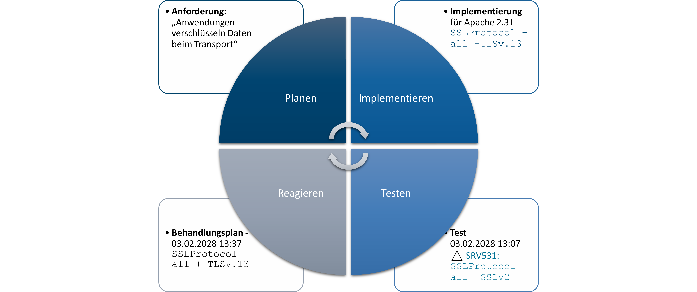
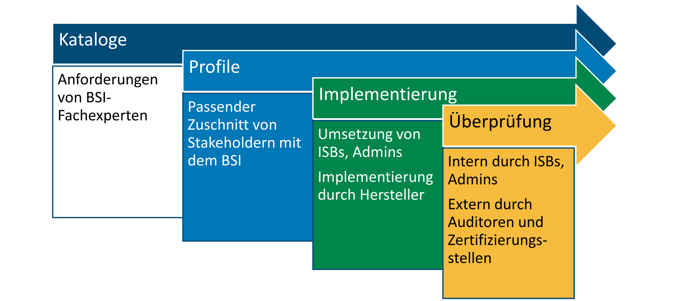

# BSI OSCAL FAQ

## Was ist OSCAL?

Die [**Open Security Controls Assessment Language (OSCAL)**](https://pages.nist.gov/OSCAL/) ist ein standardisiertes, maschinenlesbares Framework, das von NIST entwickelt wurde, um die Effizienz und Konsistenz von Dokumentationen zur Informationssicherheit zu verbessern. Es ermöglicht eine Automatisierung über den gesamten Compliance-Lebenszyklus hinweg.



### Hintergrund

Traditionell war das händische Erstellen von Compliance-Dokumentationen in Word oder Tabellen oft zeitaufwendig und fehleranfällig. OSCAL begegnet diesen Herausforderungen, indem es eine universelle Sprache bereitstellt, um Sicherheitsanforderungen und deren Umsetzung als automatisierbare Datenstrukturen auszudrücken.

### Funktionsweise

* **Strukturierte Daten:** OSCAL nutzt Formate wie XML, JSON oder YAML, um Anforderungskataloge, Umsetzungspläne, Bewertungspläne und weitere Informationen darzustellen.
* **Automatisierung:** Die maschinenlesbare Natur von OSCAL ermöglicht eine leichtere Automatisierung, Validierung und Analyse von Sicherheitskontrollen.
* **Interoperabilität:** Durch die Standardisierung können Informationen konsistent über verschiedene Systeme und Teams verteilt werden.

### Vorteile

* **Reduzierter manueller Aufwand:** Automatisierte Prozesse verringern die Notwendigkeit manueller Eingriffe.
* **Minimierung menschlicher Fehler:** Konsistente Datenverteilung sorgt für weniger Fehlerquellen.
* **Optimierter Umgang mit Sicherheitskontrollen:** Compliance-Daten können leichter geteilt, verglichen und automatisiert werden.

Kurz gesagt, verwandelt OSCAL statische Unterlagen in maschinenlesbare Daten, sodass Computer die Validierung, Berichterstattung und Analyse von Sicherheitskontrollen unterstützen können.

## Warum werden Sicherheitsvorgaben des BSI im OSCAL-Format bereitgestellt?

OSCAL ist ein bereits etabliertes, international anerkanntes Framework. Dadurch entfällt die Notwendigkeit, eine eigene, nationale Lösung zu entwickeln, und es wird die Kompatibilität mit anderen internationalen Sicherheitsstandards verbessert.

## Was sind die Hauptbestandteile von OSCAL?

OSCAL ist in mehrere Dokumentenstrukturen gegliedert, die spezifische Modelle für verschiedene Aspekte der Sicherheitskontrollen enthalten. Die wesentlichen Komponenten von OSCAL sind:

### 1. Kataloge

Ein OSCAL-Katalog ist eine Sammlung von Sicherheitsanforderungen, die in einem strukturierten, maschinenlesbaren Format definiert sind. Ein Standard wie **ISO 27001 Annex A** oder **BSI Grundschutz++** kann als OSCAL-Katalog dargestellt werden. Kataloge organisieren Anforderungen in Gruppen oder Familien, um die Übersichtlichkeit zu verbessern. Zudem können den Anforderungen weitere Metadaten hinzugefügt werden, z.B. Hinweistexte oder Schlagworte. Da alle weiteren OSCAL-Dokumente auf diesen Katalogen basieren, müssen alle verwendeten Anforderungen hier zuerst definiert werden.

### 2. Profiles

Ein **OSCAL-Profile** dient dazu, Anforderungen aus einem oder mehreren Katalogen auszuwählen und anzupassen. Dies ermöglicht die Erstellung spezifischer Baselines, indem:

* **Anforderungen importiert, entfernt oder angepasst** werden
* **Nicht anwendbare Anforderungen** entfernt werden
* **Spezifische Parameterwerte** festgelegt werden
* **Metadaten wie Umsetzungshinweise oder Tags** modifiziert werden

Beispielsweise könnten Mindeststandards oder branchenspezifische Sicherheitsstandards bestimmte Anforderungen aus dem Kompendium des Grundschutz++ auswählen und diese um spezifischere, eigene Anforderungen aus einem eigenen Katalog ergänzen. Ein OSCAL-Profile gewährleistet **Rückverfolgbarkeit**, da jede Anpassung auf den Originalkatalog zurückgeführt werden kann.

### 3. Implementierungsebene (System-Sicherheitsplan und Komponenten)

Die **Implementierungsebene** beschreibt, wie Anforderungen tatsächlich umgesetzt oder vorbereitet werden. Zwei Modelle sind hier zentral:

* **System-Sicherheitsplan (SSP / Implementierungsplan):**
  Ein SSP dokumentiert, wie die ausgewählten Anforderungen in einem konkreten Informationsverbund oder System erfüllt werden. Er enthält nicht nur technische Aspekte (z. B. Konfigurationen oder eingesetzte Software), sondern kann auch die Umsetzung organisatorischer **Richtlinien und Verfahren** darstellen. Damit ist der SSP sowohl für Technik als auch für Management relevant.

  **Beispiel:** Ein SSP könnte beschreiben, wie eine Organisation die Anforderung zur Zugriffskontrolle umsetzt – etwa durch den Einsatz von Multi-Faktor-Authentifizierung (technisch) und durch eine Richtlinie, die regelmäßige Passwortänderungen vorschreibt (organisatorisch).

* **Komponentendefinition (Component Definition):**
  Während ein SSP die konkrete Umsetzung in einem System beschreibt, handelt es sich bei Komponentendefinitionen um **wiederverwendbare Vorlagen**. Sie beschreiben die Eigenschaften einer spezifischen Komponente – sei es Hardware, Software, ein externer Service, eine Richtlinie, ein Prozess, ein Verfahren oder auch ein Compliance-Artefakt. Diese Definitionen sind keine Implementierungen an sich, sondern **Vorlagen**, die in unterschiedlichen SSPs referenziert werden können.

  **Beispiel:** Eine Komponentendefinition könnte die Standardkonfiguration eines „Windows Server 2025“ beschreiben oder auch eine generische Datensicherungsrichtlinie einer Institution. Diese OSCAL Komponentendefinitionen können in die Sicherheitsdokumentationen von verschiedenen Projekten oder Systemen eingebunden werden, ohne dass sie jedes Mal neu dokumentiert werden müssen.



### 4. Bewertungsebene

Die **Bewertungsebene** in OSCAL umfasst drei zentrale Dokumenttypen, die speziell für Prüfungen und Nachweise der Umsetzung gedacht sind:

* **Assessment Plan (Prüfplan):** Beschreibt, wie eine Prüfung durchgeführt werden soll. Er enthält z. B. Prüfschritte, Prüfkriterien und Verantwortlichkeiten. Ein Prüfplan kann automatisiert aus den im SSP dokumentierten Anforderungen generiert werden.  
  **Beispiel:** Wenn im SSP festgelegt wurde, dass Passwörter alle 90 Tage geändert werden müssen, kann der Prüfplan automatisch eine Prüfroutine enthalten, die diese Vorgabe testet.

* **Assessment Results (Prüfergebnisse):** Enthalten die dokumentierten Resultate der Prüfungen. Diese Ergebnisse können sowohl manuelle Feststellungen als auch automatisch erzeugte Prüfberichte umfassen.  
  **Beispiel:** Das Prüfergebnis könnte automatisch festhalten, dass in 95 % der Benutzerkonten die Passwortregel korrekt umgesetzt ist, während 5 % abweichen.

* **POA&M (Plan of Action & Milestones / Behandlungsplan):** Definiert Maßnahmen zur Behebung festgestellter Abweichungen oder Schwachstellen. Er dokumentiert Fristen, Verantwortliche und Prioritäten.  
  **Beispiel:** Wenn eine Passwortregel verletzt wurde, enthält der POA&M den Eintrag, dass die betroffenen Konten innerhalb von 14 Tagen angepasst werden müssen.

### Vorteile der Automatisierung

Die Bewertungsebene in OSCAL bringt besonders für das Management Vorteile durch **Automatisierung**:

* **Schnelle Validierung:** Parameterwerte aus dem SSP (z. B. Passwortgültigkeit, Backup-Zyklen) können automatisch überprüft werden.
* **Transparenz:** Ergebnisse werden nachvollziehbar dokumentiert und können ohne manuelle Nacharbeit in Berichte übernommen werden.
* **Effizienzsteigerung:** Wiederkehrende Prüfungen lassen sich automatisieren und sparen Zeit.
* **Konsistenz:** Einheitliche Prüfkriterien und standardisierte Dokumente reduzieren Interpretationsspielräume.

Damit wird die Lücke zwischen Dokumentation und praktischer Umsetzung geschlossen – von der Planung, über die Prüfung bis zur Maßnahmenverfolgung.

### Fazit

OSCAL ermöglicht eine **strukturierte, maschinenlesbare und transparente** Verwaltung von Sicherheitsanforderungen. Es bietet:

* **Standardisierte Anforderungskataloge**
* **Anpassbare Baseline-Profile**
* **Nachvollziehbare Systemimplementierungen**
* **Automatisierbare Bewertungen und Audits**

Durch die Nutzung von OSCAL lassen sich Sicherheits-Compliance-Prozesse effizienter gestalten und besser in bestehende IT-Systeme integrieren.

## Wie ist eine OSCAL-Datei aufgebaut?

Typische OSCAL-Dateien (egal ob Katalog, Profile oder SSP) liegen in **XML**, **JSON** oder **YAML** vor. Auch wenn keine Programmierkenntnisse erforderlich sind, ist ein grundlegendes Verständnis von strukturiertem Text hilfreich. Eine OSCAL-Datei besteht meist aus den folgenden Komponenten:

#### 1. Metadaten

Enthält allgemeine Informationen zur Datei, wie:

* **Titel**
* **Datum der letzten Änderung**
* **Organisation**

**Beispiel:**

```yaml
metadata:
  title: "Grundschutz++ Kompendium 2026"
  last-modified: 2025-09-10
  organization: "Bundesamt für Sicherheit in der Informationstechnik"
```

#### 2. Hauptteil

Der Inhalt variiert je nach Dateityp:

* **OSCAL Katalog**: Enthält eine Liste von Anforderungen, oft in Gruppen oder Familien organisiert.
* **OSCAL Profile**: Gibt an, aus welchem Katalog importiert wird und welche Anforderungen inkludiert oder modifiziert werden.
* **OSCAL SSP (System Security Plan)**: Beinhaltet:

  * Informationen über das System (Name, Beschreibung)
  * Systemkomponenten
  * Beschreibung der Umsetzung jeder relevanten Anforderung (Status, Verantwortliche, Belege)

**Beispiel für einen Katalog-Eintrag:**

```yaml
controls:
  - id: "BER.1.1"
    title: "Verfahren und Regelungen"
    description: "Regelt die Verwaltung von Benutzerkonten."
```

#### 3. Back-Matter (optional)

Dient zur Referenzierung zusätzlicher Ressourcen, wie:

* Richtliniendokumente
* Diagramme
* Verlinkte externe Dateien

**Beispiel:**

```yaml
back-matter:
  resources:
    - title: "Zugriffsrichtlinien"
      href: "https://example.com/zugriffsrichtlinien.pdf"
```

## Welche Best Practices für Autoren gibt es?

* **Logische Gliederung:** Teilen Sie Ihren Katalog in klar abgegrenzte, thematische oder domänenspezifische Abschnitte auf. Dies erleichtert das Verständnis, die Wartung und spätere Erweiterungen.
* **Vorhandene Vorlagen nutzen:** Greifen Sie auf OSCAL-Templates, Beispielkataloge und LLM zurück, um den Einstieg zu erleichtern und häufige Fehler zu vermeiden.
* **Validierung:** Verwenden Sie automatisierte [Validierungstools](https://pages.nist.gov/oscal-tools/demos/csx/validator/), die prüfen, ob Ihr Dokument den OSCAL-Schemata entspricht. So können Fehler frühzeitig erkannt und behoben werden.
* **Versionsmanagement:** Nutzen Sie Versionskontrollsysteme (z. B. Git), um Änderungen zu verfolgen und bei Bedarf auf frühere Versionen zurückgreifen zu können.
* **Teamarbeit:** Arbeiten Sie eng mit anderen Fachexperten zusammen – etwa aus den Bereichen Compliance, Implementierung und Audit – um ein möglichst praxisnahes und robustes OSCAL Profile zu erstellen.
* **Prototyping:** Erstellen Sie zunächst eine erste Version (MVP) und lassen Sie diese von Stakeholdern validieren.
* **Kontinuierliche Verbesserung:** Integrieren Sie Feedback, testen Sie regelmäßig und passen Sie den Katalog an neue Anforderungen und geänderte Sicherheitsstandards an.
* **Automatisierung:** Integrieren Sie die OSCAL-Artefakte in automatisierte Prozesse, um bei jeder Änderung eine automatische Validierung und gegebenenfalls einen Deployment-Vorgang durchzuführen.
* **Skripte und Tools:** Nutzen Sie Skripte, um wiederkehrende Aufgaben (z. B. Formatierung, Validierung) zu automatisieren und so Fehler zu minimieren.

## Wie läuft die Erstellung eines OSCAL-Implementierungsplans (SSP) ab?

### Schritt 1: Katalog besorgen
Laden Sie den OSCAL-Katalog des erforderlichen Frameworks herunter (z. B. das [Kompendium Grundschutz++](https://github.com/BSI-Bund/Stand-der-Technik-Bibliothek/tree/main/Kompendien/Grundschutz%2B%2B-Kompendium)) oder [NIST 800-53](https://csrc.nist.gov/publications/detail/sp/800-53/rev-5/final)).

### Schritt 2: Profile definieren
Erstellen Sie ein Profile, das die aus dem Katalog zu verwendenden Anforderungen festlegt. Beispiel:
- **Importiere alle Kompendium-Anforderungen**
- **Schließe Kontrolle A.12.4 aus**

### Schritt 3: SSP erstellen
1. Legen Sie eine neue OSCAL-SSP-Datei an.
2. Füllen Sie die Metadaten aus.
3. Verweisen Sie auf das verwendete OSCAL Profile.
4. Listen Sie alle Systemkomponenten auf (z. B. Webserver, Datenbank).

### Schritt 4: Umsetzung dokumentieren
Für jede Kontrolle fügen Sie eine kurze Beschreibung der Umsetzung hinzu, inklusive:
- **Status:** vollständig, teilweise oder geplant
- **Referenzen:** zu relevanten Belegen

### Schritt 5: Validierung und Darstellung
1. Nutzen Sie Schema-Validierung, um sicherzustellen, dass Ihre OSCAL-Datei korrekt aufgebaut ist. Entsprechende JSON-Schemata sind im [JSON Schema Store](https://www.schemastore.org/) erhältlich.
2. Verwenden Sie ein OSCAL-kompatibles Anzeigeprogramm oder wandeln Sie das Dokument in ein leserfreundliches Format (HTML, PDF, etc.) um, um den Inhalt zu prüfen.

## Welche Möglichkeiten bietet OSCAL für Unternehmen und Behörden?
- Einfache Integration mit Compliance- und Audit-Tools: OSCAL-Daten können direkt in Sicherheitsmanagement-Tools eingebunden werden. Speziell in Deutschland arbeiten bereits zahlreiche [Hersteller von IT-Grundschutz-Tools](https://www.bsi.bund.de/DE/Themen/Unternehmen-und-Organisationen/Standards-und-Zertifizierung/IT-Grundschutz/IT-Grundschutz-Kompendium/Alternative-IT-Grundschutztools/IT-Grundschutztools.html) an der Integration in ihre Software.
- Vereinfachte Berichterstattung: Compliance-Dokumentation kann automatisiert erstellt und aktualisiert werden.
  
## Weitere Informationen
- [US-NIST OSCAL-Dokumentation](https://pages.nist.gov/OSCAL/) und [Chat](https://app.gitter.im/#/room/#usnistgov-OSCAL_Lobby:gitter.im)
- [Europäische OSCAL-Initiative](https://euroscal.eu/)
- [Datenbank von OSCAL Inhalten](https://registry.oscal.io/documents)

## OSCAL Tools (international)
- [Übersicht der wichtigsten OSCAL-Werkzeuge](https://oscal.io/tools/)
- [Sammlung von Community-Werkzeugen](https://github.com/oscal-club/awesome-oscal)
- [Online Viewer](https://viewer.oscal.io/) oder [Docker Image](https://github.com/EasyDynamics/oscal-editor-deployment)
- [Konverter](https://github.com/usnistgov/OSCAL/blob/main/build/README.md#converters)
- [Deep Diff](https://github.com/usnistgov/oscal-deep-diff)
